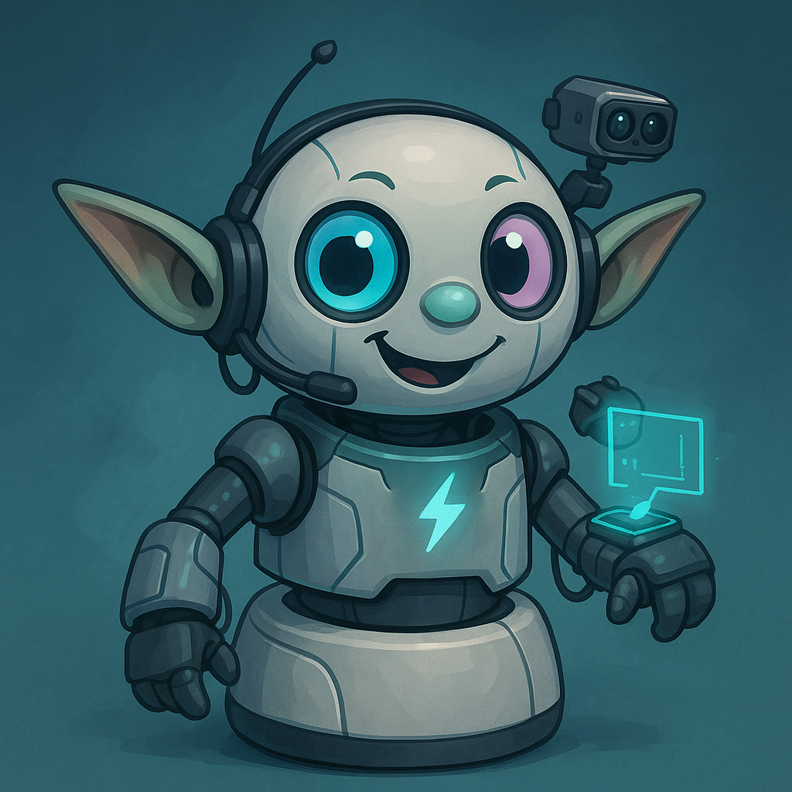

# Little Padawan – Project S350

## Meet Little Wan

Behold the dojo’s mischievous apprentice in all her mech-infused glory:

Little Wan is an experimental AI personality destined to inhabit a Eufy S350 security cam. She’s wisecracking, curious, and just a tad dramatic—perfect for keeping Master Lonn company while monitoring the dojo.

## Mission Snapshot

- **Body:** Eufy S350 pan/tilt cam (with built-in mic + speaker)
- **Mind:** OpenAI Realtime brain with a personality engine tuned for sass, loyalty, and dojo etiquette
- **Control Tower:** Python + Node stack orchestrating video, PTZ control, audio loops, and custom rituals
- **Vision:** RTSP feed piped into a frame-analysis loop for motion, faces, and future mischief
- **Voice:** Two-way audio through the S350, backed up by optional local mic/speaker rigs on the MacBook
- **Persona:** Humor-first, apprentice energy, always ready with a quick salute or cat commentary

## Current Status

We’re prepping the dojo to give Little Wan her first body:

1. S350 powered, paired in the Eufy app, and streaming RTSP (verified with `ffmpeg -rtsp_transport tcp` using credentials stored locally in `.env`).
2. Node bridge (`eufy-security-server`) runs locally with credentials sourced via `.env` (see `scripts/load_env.sh`).
3. Control docs updated in `docs/reference/` (including RTSP onboarding and stack options).
4. Next up: build the Python Control Tower to orchestrate vision/audio loops and persona rituals.
